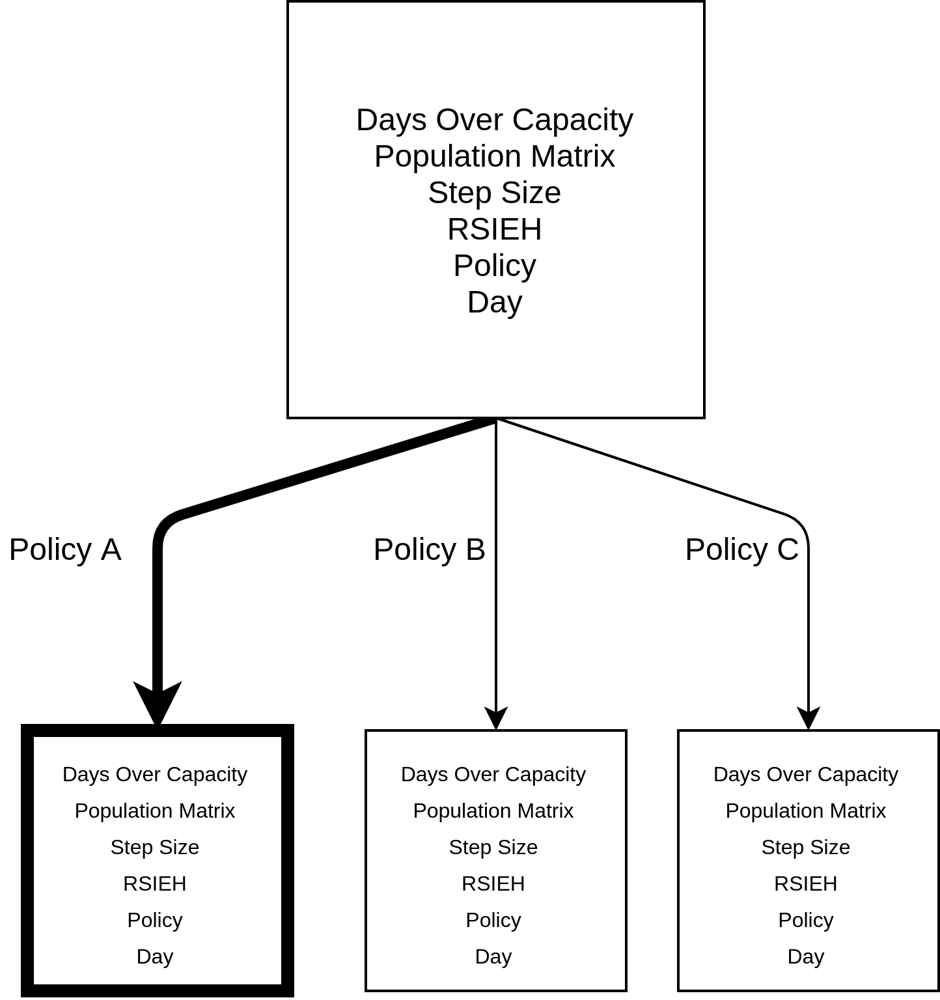
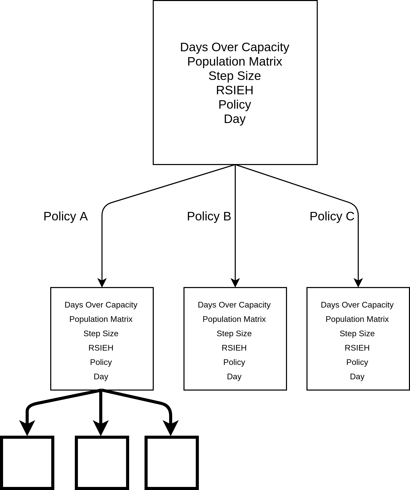
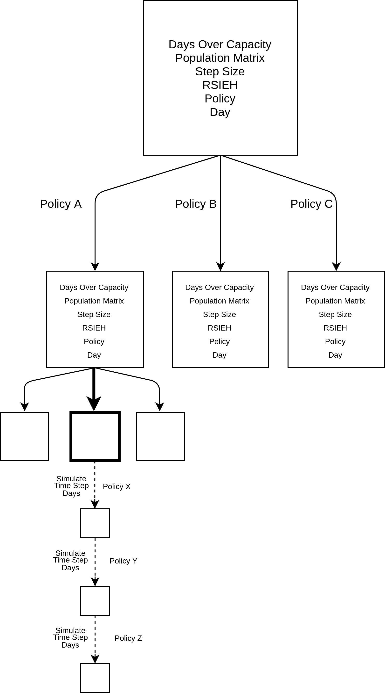
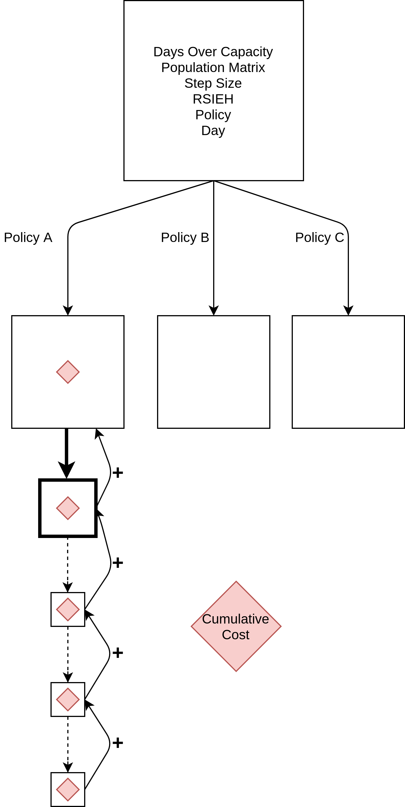
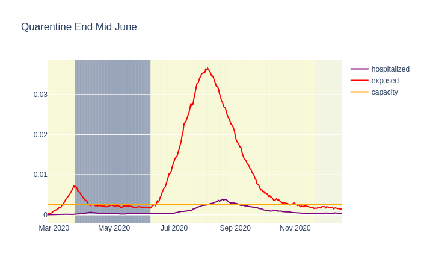
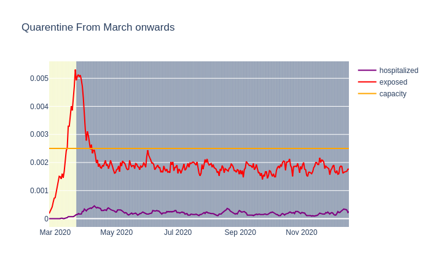
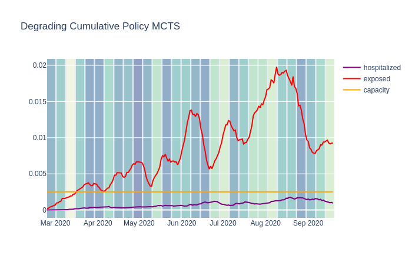
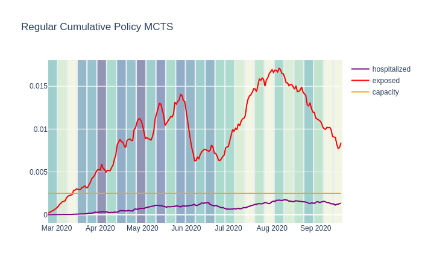
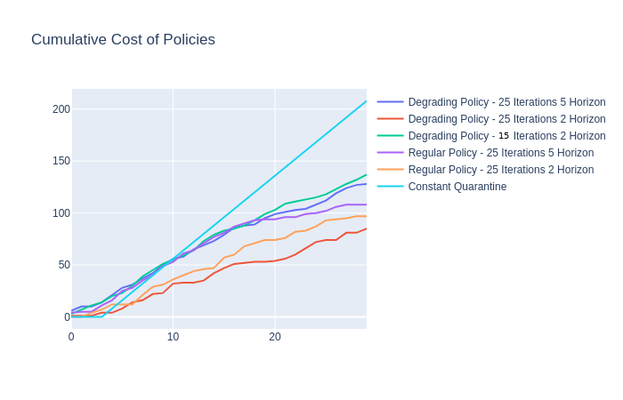

# Monte Carlo Tree Search Policy Optimization

With the population graph and pandemic simulation models done, the Monte Carlo Tree Search method was used to estimate the best policies at each time, such that the number of hospitalized patients was never higher than the number of available hospital beds.

Each node of the tree contains information of a given day of the pandemic.

The data in a node is:

* Population matrix: a Px4 numpy array, where P is the size of the population and each columns stores the id of the person, used to reference that person in the graph, the person current status of phase in the disease, the day at which the person was infected (used only for analysis) and the remaining time at the current state.

* RSIEH: Tuple containg information regarding the total number of Recovered, Susceptible, Infected, Exposed and Hospitalized. Two nodes are considered the same if their RSIEH values are equal.

* Policy: Current policy to be adopted by the node. All nodes are initialized with policy = 0, it policy is not given.

* Step Size: For how many days should the simulation run, with given policy. At the end of each day, the attributes of the node are updated.

* Days over capacity: This attribute is initialized as 0 and for each day of the simulation, it is incremented by one if there are more hospitalized people than bed available.

* Which day of the pandemic this node represents. Used only for analysis.


The reward of each node is computed as follows:

```python
     def getReward(self):
        return (-np.sum(np.exp(self.cost_of_policy)) - 10e6 * self.days_over_capacity)
```

The tree is initialized at a root node that contains a population matrix and a day. The step size is also defined at this stage

```python

current_state = treeNode(CovidState(pop_matrix, 0, step_size), None)
```

The tree is initialized with the following parameters:

* Iteration Limit: For a given steo in the simulation, how many rollouts should be carried out in total.
* Step Size: For How long should a single policy be carried out, once chosen
* Horizon: How many periods of lenght Step Size should be carried out in a roolut.
* Days: Total number of days for the main simulation
* RolloutPolicy: Which Rollout Policy Should be used.

### The Monte Carlo Tree Search algorithm is performed as follows:


## Select

At each iteration, the best node is selected based on the UCB value:

```python
     def getBestChild(self, node, explorationValue):
        bestValue = float("-inf")
        bestNodes = []
        for child in node.children.values():
            nodeValue = child.totalReward / child.numVisits + (
                explorationValue * np.sqrt(np.log(node.numVisits)
                                           / child.numVisits))
            if nodeValue > bestValue:
                bestValue = nodeValue
                bestNodes = [child]
            elif nodeValue == bestValue:
                bestNodes.append(child)
        return random.choice(bestNodes)
```

The deault explorationValue is equal to 2




# Expand

For each possible policy, a new node is created as a children of the node that was selected before. If all the children have already been created, a new selection round is executed. 




# Rollout 

When a leaf node is reached after an expansion, a rollout is executed. 

One rollout is composed of a number of simulations equal to the value of the Horizon attribute of the tree.

So starting at the leaf node with policy A, a simulation of time_step size is performed and at each day the values of the node are updated. Then a new child state is chosen. The new state is such that it has the same attributes as the parent state that has just been simulated and its new policy is chosen at random from all the policies that have an absolute diffence of cost of 2 units. In other words, if the parent node policy is A, the new child node will have a policy A* that satisfies 

$cost(A)-2 <= cost(A*) <= cost(A)+2$

A single rollout is composed of n parallelized simulations and the final value that is backpropagated is the mean of those n simulations
                                 



# Backpropagate

Finally, after a number of simulations equal to horizon have been performed, the values of the rewards are added to each of the parent nodes.

The reward is equal to:


```python
     def getReward(self):
        return (-np.sum(np.exp(self.cost_of_policy)) - 10e6 * self.days_over_capacity)
```

Where days_over_capacity is representative of the days that there were more hospitalized than avaliable bed during the time_Step days of the simulation of the current node.




So the cost at Node $N_x$ is equal to:

$Cost(N_X) = cost(N_X) + Cost(N_{X+1}) + Cost(N_{X+2}) + .... + Cost(N_{X+k}), where,  k = horizon$

An alternative backpropagating method was proposed, where the father the simulation is from the starting node, a degrading value is attributed to it. This was done to incentivize polcies with better rewards in the short term.
The cost is then defined as 

$Cost(N_X) = cost(N_X)*0.5^0 + Cost(N_{X+1})*0.5^1 + Cost(N_{X+2})*0.5^2 + .... + Cost(N_{X+k})*0.5^k, where,  k = horizon$


# Available Policies

The policies that can be chosen are as follows:

```python 
policies_restrictions_by_value = {
    10: {'work':  1,  'school': 1,  'home': 0, 'neighbor':  1},
    9: {'work': .8,  'school': 1,  'home': 0, 'neighbor': .8},
    8: {'work': .6,  'school': 1,  'home': 0, 'neighbor': .6},
    7: {'work': .4,  'school': 1,  'home': 0, 'neighbor': .4},
    6: {'work': .2,  'school': 1,  'home': 0, 'neighbor': .2},
    5: {'work':  1,  'school': 0,  'home': 0, 'neighbor': .5},
    4: {'work': .8,  'school': 0,  'home': 0, 'neighbor': .4},
    3: {'work': .6,  'school': 0,  'home': 0, 'neighbor': .3},
    2: {'work': .4,  'school': 0,  'home': 0, 'neighbor': .2},
    1: {'work': .2,  'school': 0,  'home': 0, 'neighbor': .1},
    0: {'work':  0,  'school': 0,  'home': 0, 'neighbor':  0}
}
```

Where each key represents the cost associated with taking a policy and each key and value pair represent a value between zero and one, representing how restricted the given relation will be, where a value of zero represents the relation operating withou any restrictions and a value of 1 is equivalent to the relation being completely diasble.

# Estimating effect of MCTS policy selection

# Scenario 1: End Quarantine Mid-June




# Scenario 2: Quarantine until December




# Degrading Rollout MCTS



# Regular Cumulative Rollout MCTS



# Comparative total Cost




```python

```
